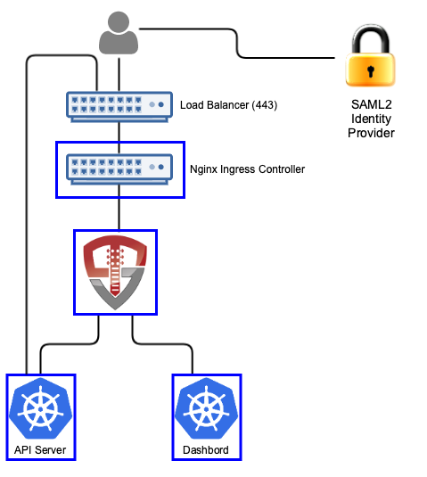

# Orchestra Login Portal for ActiveDirectory

[](https://vimeo.com/319288583)

*Short video of logging into Kubernetes and using kubectl using SAML2*

Orchestra Login Portal provides a login portal for Kubernetes that allows you to authenticate with your SAML2 identity provider, use groups from your identity provider for RBAC authorizations and provides integration for both `kubectl` and the Kubernetes Dashboard (https://github.com/kubernetes/dashboard).  The portal runs inside of Kubernetes, leveraging Kubernetes for scalability, secret management and deployment. 



When a user accesses Kubernetes using Orchestra, they'll access both the login portal and the dashboard through OpenUnison (instead of directly via an ingress).  OpenUnison will inject the user's identity into each request, allowing the dashboard to act on their behalf.  The login portal has no external dependencies outside of your identity provider and Kubernetes.  All objects for session state are stored as CRDs.

# Deployment

## What You Need To Start

Prior to deploying Orchestra you will need:

1. Kubernetes 1.10 or higher
2. The Nginx Ingress Controller deployed (https://kubernetes.github.io/ingress-nginx/deploy/)
3. The SAML2 metadata for your identity provider
4. Deploy the dashboard to your cluster


## Create Environments File

Orchestra stores environment specific information, such as host names, passwords, etc, in a properties file that will then be loaded by OpenUnison and merged with its configuration.  This file will be stored in Kubernetes as a secret then accessed by OpenUnison on startup to fill in the `#[]` parameters in `unison.xml` and `myvd.conf`.  For instance the parameter `#[OU_HOST]` in `unison.xml` would have an entry in this file.  Below is an example `input.props` file:

```properties
OU_HOST=k8sou.tremolo.lan
K8S_DASHBOARD_HOST=k8sdb.tremolo.lan
K8S_URL=https://k8s-installer-master.tremolo.lan:6443
AD_BASE_DN=cn=users,dc=ent2k12,dc=domain,dc=com
AD_HOST=192.168.2.75
AD_PORT=636
AD_BIND_DN=cn=Administrator,cn=users,dc=ent2k12,dc=domain,dc=com
AD_BIND_PASSWORD=password
AD_CON_TYPE=ldaps
SRV_DNS=false
OU_CERT_OU=k8s
OU_CERT_O=Tremolo Security
OU_CERT_L=Alexandria
OU_CERT_ST=Virginia
OU_CERT_C=US
unisonKeystorePassword=start123
USE_K8S_CM=true
SESSION_INACTIVITY_TIMEOUT_SECONDS=900
MYVD_CONFIG_PATH=WEB-INF/myvd.conf
```

*Detailed Description or Properties*

| Property | Description |
| -------- | ----------- |
| OU_HOST  | The host name for OpenUnison.  This is what user's will put into their browser to login to Kubernetes |
| K8S_DASHBOARD_HOST | The host name for the dashboard.  This is what users will put into the browser to access to the dashboard. **NOTE:** `OU_HOST` and `K8S_DASHBOARD_HOST` **MUST** share the same DNS suffix. Both `OU_HOST` and `K8S_DASHBOARD_HOST` **MUST** point to OpenUnison |
| K8S_URL | The URL for the Kubernetes API server |
| AD_BASE_DN | The search base for Active Directory |
| AD_HOST | The host name for a domain controller or VIP.  If using SRV records to determine hosts, this should be the fully qualified domain name of the domain |
| AD_PORT | The port to communicate with Active Directory |
| AD_BIND_DN | The full distinguished name (DN) of a read-only service account for working with Active Directory |
| AD_BIND_PASSWORD | The password for the `AD_BIND_DN` |
| AD_CON_TYPE | `ldaps` for secure, `ldap` for plain text |
| SRV_DNS | If `true`, OpenUnison will lookup domain controllers by the domain's SRV DNS record |
| OU_CERT_OU | The `OU` attribute for the forward facing certificate |
| OU_CERT_O | The `O` attribute for the forward facing certificate |
| OU_CERT_L | The `L` attribute for the forward facing certificate |
| OU_CERT_ST | The `ST` attribute for the forward facing certificate |
| OU_CERT_C | The `C` attribute for the forward facing certificate |
| unisonKeystorePassword | The password for OpenUnison's keystore |
| USE_K8S_CM | Tells the deployment system if you should use k8s' built in certificate manager.  If your distribution doesn't support this (such as Canonical and Rancher), set this to false |
| SESSION_INACTIVITY_TIMEOUT_SECONDS | The number of seconds of inactivity before the session is terminated, also the length of the refresh token's session |


## Prepare Deployment

Perform these steps from a location with a working `kubectl` configuration:

1. Create a directory to store secrets, ie `/path/to/secrets`, and put `input.props` (the properties file defined above) in that directory
2. Create a directory for config maps, ie `/path/to/configmaps`, copy the metadata from your SAML2 identity provider to `/path/to/configmaps/saml2-metadata.xml`

## Deployment

Based on where you put the files from `Prepare Deployment`, run the following:

```
curl https://raw.githubusercontent.com/TremoloSecurity/kubernetes-artifact-deployment/master/src/main/bash/deploy_openunison.sh | bash -s /path/to/configmaps /path/to/secrets https://raw.githubusercontent.com/OpenUnison/openunison-k8s-login-saml2/master/src/main/yaml/artifact-deployment.yaml
```

The output will look like:

```
namespace/openunison-deploy created
configmap/extracerts created
secret/input created
clusterrolebinding.rbac.authorization.k8s.io/artifact-deployment created
job.batch/artifact-deployment created
NAME                        READY     STATUS    RESTARTS   AGE
artifact-deployment-jzmnr   0/1       Pending   0          0s
artifact-deployment-jzmnr   0/1       Pending   0         0s
artifact-deployment-jzmnr   0/1       ContainerCreating   0         0s
artifact-deployment-jzmnr   1/1       Running   0         4s
artifact-deployment-jzmnr   0/1       Completed   0         15s
```

Once you see `Completed`, you can exit the script (`Ctl+C`).  This script creates all of the appropriate objects in Kubernetes, signs certificates and deploys both OpenUnison and the Dashboard.  


## Complete Integrate with your Identity Provider

Run `kubectl describe configmap api-server-config -n openunison` to get the metadata for your identity provider.  Import it into your identity provider and add the following attributes to the assertion so OpenUnison knows how the logged in uers is:

| Attribute Name | Active Directory Attribute | Description |
| -------------- | -------------------------- | ----------- |
| uid            | samAccountName             | User's login id |
| givenName      | givenName                  | User's first name |
| sn             | sn                         | User's last name |
| mail           | mail                       | User's email address |
| memberOf       | memberOf                   | List of user's groups |

If using Active Directory Federation Services, you can use the following claims transformation rule:
```
c:[Type == "http://schemas.microsoft.com/ws/2008/06/identity/claims/windowsaccountname", Issuer == "AD AUTHORITY"]
 => issue(store = "Active Directory", types = ("http://schemas.xmlsoap.org/ws/2005/05/identity/claims/nameidentifier", "uid", "givenName", "sn", "mail","memberOf"), query = ";sAMAccountName,sAMAccountName,givenName,sn,mail,memberOf;{0}", param = c.Value);
```

Once the metadata is imported and the attributes are added, you are ready to login to Orchestra.

## Complete SSO Integration with Kubernetes

Run `kubectl describe configmap api-server-config -n openunison` to get the SSO integration artifacts.  The output will give you both the certificate that needs to be trusted and the API server flags that need to be configured on your API servers.

## First Login

To login, open your browser and go to the host you specified for `OU_HOST` in your `input.props`.  For instance if `OU_HOST` is `k8sou.tremolo.lan` then navigate to https://k8sou.tremolo.lan.  You'll be prompted for your Active Directory username and password.  Once authenticated you'll be able login to the portal and generate your `.kube/config` from the Tokens screen.

## Authorizing Access via RBAC

On first login, if you haven't authorized access to any Kubernetes roles you won't be able to do anything.  There are two approaches you can take:

### Group Driven Membership

If your identity provider can populate group names into the `memberOf` attribute of the assertion, you can use those groups for authorization via OpenUnison.  OpenUnison will provide all of a user's groups via the `id_token` supplied to Kubernetes.  The `groups` claim is a list of values, in this case the Distinguished Names of the user's groups.  As an example, I created a group in AD called `k8s_login_ckuster_admins` in the `Users` container of my `ent2k12.domain.com` domain.  This means the group will be `CN=k8s_login_ckuster_admins,CN=Users,DC=ent2k12,DC=domain,DC=com` (you can get the exact name of the group from the `distinguishedName` attribute of the group in Active Directory).  To authorize members of this group to be cluster administrators, we create a `ClusterRoleBinding`:

```
kind: ClusterRoleBinding
apiVersion: rbac.authorization.k8s.io/v1
metadata:
  name: activedirectory-cluster-admins
subjects:
- kind: Group
  name: CN=k8s_login_ckuster_admins,CN=Users,DC=ent2k12,DC=domain,DC=com
roleRef:
  kind: ClusterRole
  name: cluster-admin
  apiGroup: rbac.authorization.k8s.io
```

### User Driven Membership

If you are not able to populate groups into `memberOf`, you can directly add users to role bindings.  Kubernetes requires that you identify openid connect users with the prefix of the url of the identity provider.  So if your `OU_HOST` is `k8sou.tremolo.lan` and your user's login is `mmosley` your username to Kubernetes would be `https://k8sou.tremolo.lan/auth/idp/k8sIdp#mmosley`.  To create a cluster role binding to give cluster-admin access to a specific user:

```
kind: ClusterRoleBinding
apiVersion: rbac.authorization.k8s.io/v1
metadata:
  name: activedirectory-cluster-admins
subjects:
- kind: User
  name: https://k8sou.tremolo.lan/auth/idp/k8sIdp#mmosley
roleRef:
  kind: ClusterRole
  name: cluster-admin
  apiGroup: rbac.authorization.k8s.io
```

*NOTE*: There are multiple reasons this is a bad idea:
1.  Hard to audit - There is no easy way to say "what role bindings is `mmosley` a member of?
2.  Difficult to remove access - Same reason as #1, you need to figure out every role binding a user is a member of to remove
3.  Easy to get wrong - If you mistype a user's login id Kubernetes won't tell you

If you can't use Active Directory groups, take a look at the OpenUnison Identity Manager for Kubernetes - https://github.com/TremoloSecurity/openunison-qs-kubernetes/tree/activedirectory.  This tool adds on to the login capabilities with the ability to manage access to the cluster and namespaces, along with providing a self service way for users to request new namespaces and manage access.

# Whats next?

Now you can begin mapping OpenUnison's capabilities to your business and compliance needs.  For instance you can add multi-factor authentication with TOTP or U2F, Create privileged workflows for onboarding, scheduled workflows that will deprovision users, etc.

# Updating Secrets and Certificates

In order to change the secrets or update certificate store:

Download the contents of `openunison-secrets` in the `openunison` namespace into an empty directory

```
kubectl get  secret openunison-secrets -o json  -n openunison | python /path/to/openunison-k8s-idm-oidc/src/main/python/download_secrets.py
```

`download_secrets.py` is a utility script for pulling the files out of secrets and config maps.  Next, make your changes.  You can't apply over an existing secret, so next delete the current secret:

```
kubectl delete secret openunison-secrets -n openunison
```

Finally, create the secret from the directory where you downloaded the secrets:

```
kubectl create secret generic openunison-secrets --from-file=. -n openunison
```

Redeploy Orchestra to pick up the changes.  The easiest way is to update an environment variable in the `openunison` deployment